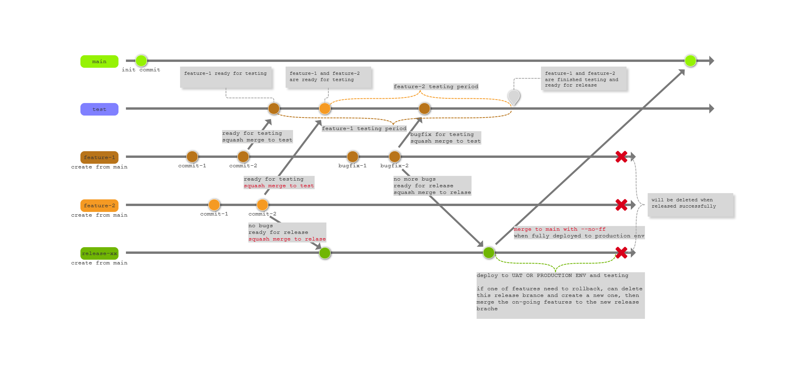

# GIT工作流规范

常驻分支：

* `main` - 默认分支，用于保存经过严格测试的主观稳定的线上版本。

    > 受保护分支，仅限仓库管理者（maintainer）执行**非快进式合并操作**： `git merge --no-ff`

* `test` - 共享测试分支，用于集成多个待测试的feature/bugfix分支，从而支持**多特性并行测试**。

    > 受保护分支，仅限测试人员（Reporter）对已完成code review的合并请求执行**压缩合并操作**：`git merge --squash`

临时分支：

* `feature` - 特性开发分支，由开发人员从main分支上创建，用于某个新特性的开发工作。

    * 命名规范：

        > `feature-<需求ID>`： `git checkout -b feature-<需求ID>` and `git push -u origin feature-<需求ID>` 
        > 其中数字为需求/缺陷的ID，所以必须先创建需求/缺陷，再写代码，杜绝「口头提需求」、「口头报bug」的情况

    * 提交规范：

        > 在开发过程中，建议每完成一个任务提交一次，commit信息为任务ID：`git commit -m "finish task: #<任务ID>"` 
        > 在测试过程中，建议每修复一个缺陷提交一次，commit信息为缺陷ID：`git commit -m "fix bug: #<缺陷ID>"`  

    * 合并规范：

        > 在提测时，向test分支创建合并请求，并邀请相关人员进行code review 
        > 在发布时，在release分支上执行**压缩合并操作**：`git merge --squash feature-<需求ID>` and `git commmit -m "feature: #<需求ID>"` 
        > 在成功发布后，执行删除分支操作：`git push -d origin feature-<需求ID>` 

* `bugfix` -  缺陷修复分支，由开发人员从main分支上创建，用于修复某个生产环境问题。

    * 命名规范：

        > `bugfix-<缺陷ID>`： `git checkout -b bugfix-<缺陷ID>` and `git push -u origin bugfix-<缺陷ID>` 

    * 提交规范：

        > commit信息为缺陷ID：`git commit -m "fix bug <bug ID>"`  

    * 合并规范：

        > 在提测时，向test分支创建合并请求，并邀请相关人员进行code review 
        > 在发布时，在release分支执行**压缩合并操作**：`git merge --squash feature-<需求ID>` and `git commmit -m "feature-<需求ID>"` 
        > 一般情况下， bugfix同feature一样遵循`开发-->测试-->发布`流程；特殊情况下，经主管审批后可不经测试直接进行发布

* `release` - 发布分支，由开发人员或者自动化发布工具从main分支上创建，用于集成多个待发布的feature/bugfix分支，从而支持**多特性合并发布**。
    * 命名规范：

        > `release-<yyyyMMdd>`： `git checkout -b release-<yyyyMMdd>` and `git push -u origin release-<yyyyMMdd>` 

    * 发布步骤：

        > 1. 在发布日创建一个release分支，将一个或多个在当日待发布的feature/bugfix分支分别**压缩合并**至该分支； 
        > 2. 执行PRE-PRODUCTION或者PRODUCTION环境的发布部署； 
        > 3. 在相应环境中执行验证工作； 
        > 4. 如发现某个特性需要回滚，则执行回滚； 
        > 5. 在成功回滚后，删除当前release分支，并重新创建一个release分支，将可继续发布的feature/bugfix分支压缩合并（merge --squash）至新release分支； 
        > 6. 重复步骤2-5，直到全部特性验证成功； 
        > 7. 当验证成功后，将当前release分支合并到main分支，合并后将release分支以及相应的feature/bugfix分支删除，至此完成整个开发、测试、发布工作。

    * 合并规范：

        > 在发布成功后，在main分支上执行**非快进式合并操作**：`git merge --no-ff release-<yyyyMMdd>`